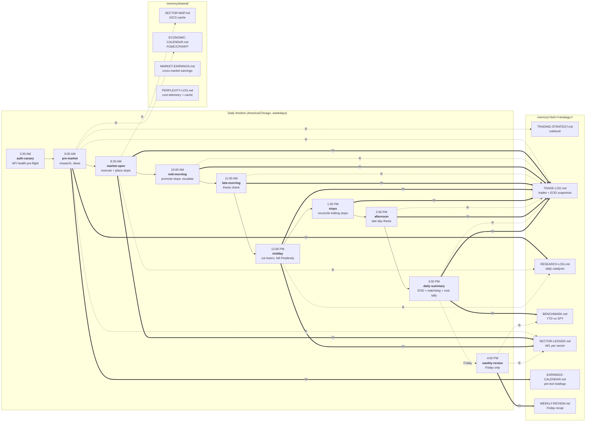

# Daily Flow

Single-glance answer to "when does what fire, and which memory files does it
touch?" Renders inline on GitHub. Update when adding or removing a routine.

**Solid (`==>`) = writes. Dashed (`-.->`) = reads.**

**Multi-bot fan-out**: each routine runs its STEP block once per enabled bot
in `memory/shared/dashboard-settings.json`. The cloud header source at
[routines/_cloud-header.md](routines/_cloud-header.md) wraps the body in
`while read BOT_ID ACCOUNT_ID STRATEGY BOT_ALLOCATION BOT_MODE; do …
done < <(bash scripts/bots.sh list)`. Per-bot memory paths use
`memory/$BOT_ID/$STRATEGY/`.

**Always-touched files**, omitted from the diagram to reduce noise:

- Every routine appends start + end heartbeats to
  `memory/<bot>/<strategy>/RUN-LOG.jsonl`. Auth-preflight failures emit a
  paired `start`/`end fail` under the discriminated routine name
  `<routine>:preflight:<bot_id>` so one bot's bad creds don't pollute the
  routine-level heartbeat (audit G4).
- Any routine that calls Perplexity appends to
  `memory/shared/PERPLEXITY-LOG.md`. Repeat queries within a CT day
  short-circuit via the cache at `memory/shared/.perplexity-cache.jsonl` so
  fan-out iterations after the first replay the cached answer (audit G2).
- `daily-summary` reads RUN-LOG (watchdog, STEP 6) and PERPLEXITY-LOG
  (cost tally, STEP 7).
- `auth-canary` writes to `TRADE-LOG.md` only on a failure.

**Discord notifications**, also off-diagram: each routine posts to a
category-specific channel (research / fill / midday / stops / eod / weekly /
error / auth-canary / alert) per the routing in
[scripts/discord.sh](scripts/discord.sh). See [env.template](env.template)
for `DISCORD_WEBHOOK_URL_*` overrides; per-bot `discordWebhookUrl` overrides
live in `memory/shared/dashboard-settings.json`.

**Local-only commands** (no cron, no diagram): `/portfolio`, `/benchmark`,
`/trade SYM N buy|sell`. Defined in [.claude/commands/](.claude/commands/).

**Local launchd helpers** (also no cron, no diagram): `cron-sync.sh` (every
15 min — backfills cloud-routine memory writes into local main),
`log-rotate.sh` (daily 02:00 — trims `~/Library/Logs/bull-stock-trader-*.log`
to 1000 lines), `price-monitor.sh` (every 10 min during market hours —
posts a `--type=alert` Discord/ntfy ping when a held position drops into a
new -5%/-6%/-7% bucket; per-bot fan-out and per-bot state files). Status
of all three is surfaced in the dashboard's `/bots` page.
