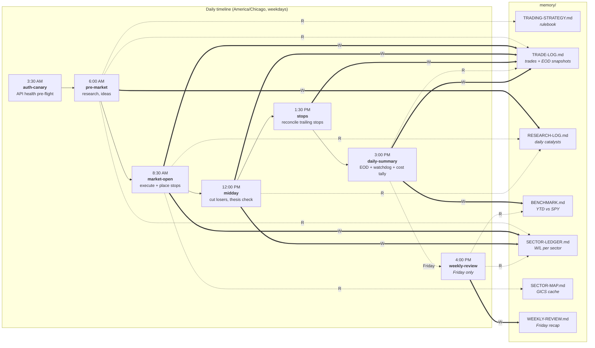

# Daily Flow

Single-glance answer to "when does what fire, and which memory files does it
touch?" Renders inline on GitHub. Update when adding or removing a routine.

**Solid (`==>`) = writes. Dashed (`-.->`) = reads.**

**Always-touched files**, omitted from the diagram to reduce noise:

- Every routine appends start + end heartbeats to `memory/RUN-LOG.jsonl`.
- Any routine that calls Perplexity appends to `memory/PERPLEXITY-LOG.md`.
- `daily-summary` reads both for the run-log watchdog (STEP 6) and the
  Perplexity cost tally (STEP 7).
- `auth-canary` writes to `TRADE-LOG.md` only on a failure.

**Discord notifications**, also off-diagram: each routine posts to a
category-specific channel (research / fill / midday / stops / eod / weekly /
error) per the routing in [scripts/discord.sh](scripts/discord.sh). See
[env.template](env.template) for `DISCORD_WEBHOOK_URL_*` overrides.

**Local-only commands** (no cron, no diagram): `/portfolio`, `/benchmark`,
`/trade SYM N buy|sell`. Defined in [.claude/commands/](.claude/commands/).
